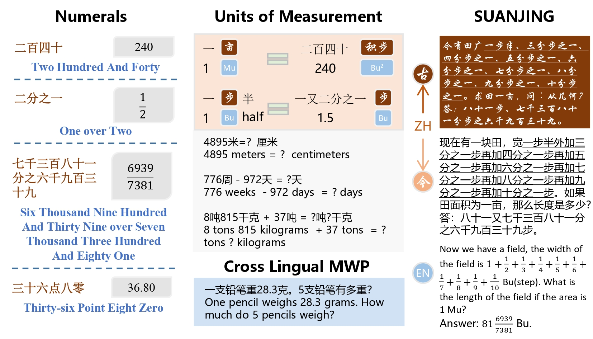

# NUMCoT: Numerals and Units of Measurement in CoT Reasoning using LLMs

Welcome to the official GitHub repository for our latest research on Numberals and Units in Chain of Thought using LLMs, titled **"NUMCoT: Numerals and Units of Measurement in Chain-of-Thought Reasoning using Large Language Models"**. In this work, we have carefully explored how small changes in numbers and units can cause dramatic variations in the reasoning performance of LLMs.

**Our work has been accepted by ACL 2024-Findings, Long paper. Here is the link to our <a href="https://www.baidu.com"><b>NUMCoT paper. </b></a> **

If you find our project interesting or helpful, we would appreciate it if you could give us a star! Your support is a tremendous encouragement to us! 

## Overview

Numbers and units are closely related aspects of human activity, and their expressions vary across different language systems. We aim to determine whether Large Language Models (LLMs) can correctly interpret numbers and units across different language systems, which is crucial for their benchmark and application in various fields and professional scenarios.  In this article, we examine mainstream LLMs' ability to handle numbers and units by constructing datasets with perturbations. We first decompose the reasoning problem between Arabic numerals and multilingual characters into sub-processes, such as text-to-number conversion and unit-based conversion. We then explored the impact of different numbers and units on LLMs' inference performance in mathematical reasoning problems. Finally, using ancient Chinese arithmetic problems, we constructed a new dataset, SUANJING, to test LLMs' performance on more challenging mathematical problems.  A series of experiments showed that LLMs still face difficulties in converting numbers and units.

## Datasets and Code

We primarily selected ChatGPT3.5, ChatGLM-turbo, ERNIE-Bot-turbo, and the Llama2 series models for our experiments. The experimental data consists of three parts.

1. **Randomly Generated Numbers**: The data is categorized into three difficulty levels: easy, medium, and hard. This part of the experiment mainly reveals the phenomenon that small changes in numbers can significantly affect the reasoning performance of LLMs. It also explores the mechanisms by which LLMs understand numbers and the reasons for the failure of chain-of-thought (CoT) reasoning. The data for this part is stored in `datasets/data/experience_first`, and the code is in `src/code/experience_first`.
2. **Randomly Generated Numbers + Units**: Similar to the first part, the data is categorized into three difficulty levels: easy, medium, and hard. This part of the experiment investigates how changes in both numbers and units can significantly impact LLMs' reasoning performance, comparing and analyzing the results with the first part to understand the reasons behind these phenomena. The data for this part is stored in `datasets/data/experience_second`, and the code is in `src/code/experience_second`.
3. **MWPs and SUANJING Datasets**: This part examines the performance of LLMs on mathematical word problems (MWPs) and the SUANJING dataset, using only ChatGPT3.5, ChatGLM-turbo, and Llama2-70B models. The focus is on understanding the changes in reasoning performance of LLMs in real-world mathematical problems and reasoning scenarios involving long-tail rare knowledge. The data for this part is stored in `datasets/data/experience_third`, and the code is in `src/code/experience_third`.